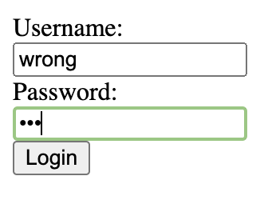
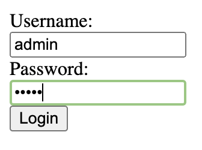

# Assignment 2
All tasks have been completed with the exception of image uploading.

## Code Structure
The main classes in the project are:
- **Server.java:** This is the main class that starts the server.
- **ClientHandler.java:** This class handles client connections and processes incoming HTTP requests.
- **FileManager.java:** This class is responsible for file operations such as reading file content and determining MIME types.
- **DatabaseManager.java:** This class handles operations related to the user database, such as validating user credentials.
- **RequestData.java:** This class parses incoming HTTP requests and stores the request data.

## Compiling & Running
Before running the server, you need to compile the Java files. You can do this by running the command following command from the root directory:  
`javac -sourcepath src -d dist $(find src -name "*.java")`  

Once the files are compiled, you can run the server by providing two command-line arguments: the port number and the root directory for serving files. For example:  
`java -cp dist src.Server 8080 public`

## Testing
To run the tests, use either of the following commands depending on your Python version: `python tests/testa2u1.py` or `python3 tests/testa2u1.py`

To test the redirection functionality, access the /redirectme.lol file. This should redirect your request to /redirect/clown.png.

To simulate an internal server error, send a POST request to a non-existent path. You can do this by executing the following command in your browser console:
```
fetch('http://localhost:8080/nonexistentpath', {
  method: 'POST',
  headers: {
    'Content-Type': 'application/json'
  },
  body: JSON.stringify({
    key: 'value'
  })
})
.then(response => response.text())
.then(data => console.log(data))
.catch((error) => {
  console.error('Error:', error);
});
```

## Exception Handling
**IOException and RuntimeException in ClientHandler's run method:**  These exceptions are caught when trying to handle a client request. If an IOException or RuntimeException occurs, it's likely due to an issue with the client's input stream or an unexpected error in the code. In this case, an error message is printed to the console, and an HTTP 500 (Internal Server Error) response is sent back to the client. This is done to ensure that the client is informed of the server-side error. This can be seen in the code from lines 29 to 45 in src/ClientHandler.java.  

**NoSuchFileException and AccessDeniedException in handleGetRequest method:** These exceptions are caught when trying to handle a GET request. If a NoSuchFileException is thrown, it means the requested file does not exist, so an HTTP 404 (Not Found) response is sent back to the client. If an AccessDeniedException is thrown, it means the client does not have permission to access the requested file, so an HTTP 401 (Unauthorized) response is sent back to the client AccessDeniedException is most likely raised when a client tries to escape the root folder. This can be seen in the code from lines 68 to 85 in src/ClientHandler.java.  

**IOException in Server's main method:** This exception is caught when trying to start the server. If an IOException is thrown, it's likely due to an issue with the server socket (e.g., the port is already in use). In this case, an error message is printed to the console, and the server is terminated. This is done to prevent the server from running in an unstable state. This can be seen in the code from lines 16 to 32 in src/Server.java.  

**IOException in FileManager's methods:** These exceptions are caught when trying to perform file operations. If an IOException is thrown, it's likely due to an issue with the file (e.g., it does not exist or cannot be read). In this case, the exception is thrown up to the calling method to be handled appropriately. This is done to ensure that file operation errors are handled at the right level. This can be seen in the code from lines 19 to 68 in src/FileManager.java.

## Screenshots
Getting a named .html file:


Getting a directory:


Getting an image:


Attempt to log in with wrong credentials:


Server response:


Attempt to log in with right credentials:


Server response:


Testing 404:


Server response:


Testing 500:


Server response:

